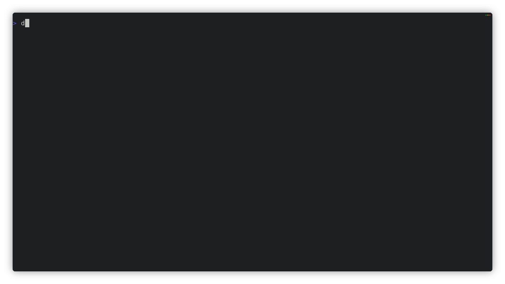

<div align="center">


# dotnet-package-explorer

**A Visual Studio-style NuGet package explorer for .NET terminals.**

<a href="#status">
  
</a>
<a href="global.json">
  
</a>
<a href="https://www.nuget.org/packages/ALSI.PackageExplorer">
  
</a>
<a href="https://github.com/alsi-lawr/dotnet-package-explorer/actions/workflows/build-and-test.yml">
  
</a>
<a href="LICENSE">
  
</a>

</div>

Browse feeds, inspect installed packages, find updates, and line up package versions across a
solution without leaving the terminal.

<div align="center">



</div>

## Install

Install Package Explorer and its Workspace Explorer backend as two .NET tools:

```console
dotnet tool install --global ALSI.PackageExplorer
dotnet tool install --global ALSI.WorkspaceExplorer
```

Then open a solution, project, or directory with either command:

```console
dotnet-pe MySolution.slnx
dotnet pe MySolution.slnx
```

Package Explorer can also be installed or run from its Nix flake:

```console
nix profile install github:alsi-lawr/dotnet-package-explorer
nix run github:alsi-lawr/dotnet-package-explorer -- MySolution.slnx
```

The Nix package still needs the separately installed Workspace Explorer backend:

```console
dotnet tool install --global ALSI.WorkspaceExplorer
```

A `linux-x64` self-contained Package Explorer application is prepared for later releases. It
includes the Package Explorer runtime, but it still needs `dotnet` and a compatible `dotnet we`
installation for package operations.

## Modes

- **Browse** searches configured NuGet sources and can include prerelease packages.
- **Installed** shows direct, transitive, central, and framework package references.
- **Updates** finds newer versions and previews one or several updates together.
- **Consolidate** finds package versions that differ across projects.

The right pane shows package details and README content. Changes are previewed before confirmation,
including affected projects, dependencies, and files. Every package list can be sorted.

## Keys

| Key | Action |
| --- | --- |
| `Tab`, `Shift-Tab` | Move between modes |
| `1` to `4` | Open Browse, Installed, Updates, or Consolidate |
| `j`, `k` | Move through rows |
| `h`, `l` | Move through tabs and horizontal controls |
| `Ctrl-h`, `Ctrl-l` | Move between panes |
| `s` | Change sorting |
| `/` | Search |
| `Space` | Select a package or project |
| `Enter` | Open details, activate a control, or confirm |
| `p` | Preview a change |
| `r` | Refresh |
| `Esc` | Go back or cancel |
| `q` | Quit |

## Status

Package Explorer is experimental and needs an interactive terminal. The self-contained application
is currently verified only for `linux-x64`. Workspace Explorer remains responsible for NuGet
access, restore, previews, and changes.

## Contributing

See [CONTRIBUTING.md](CONTRIBUTING.md).

## Licence

[MIT](LICENSE)
